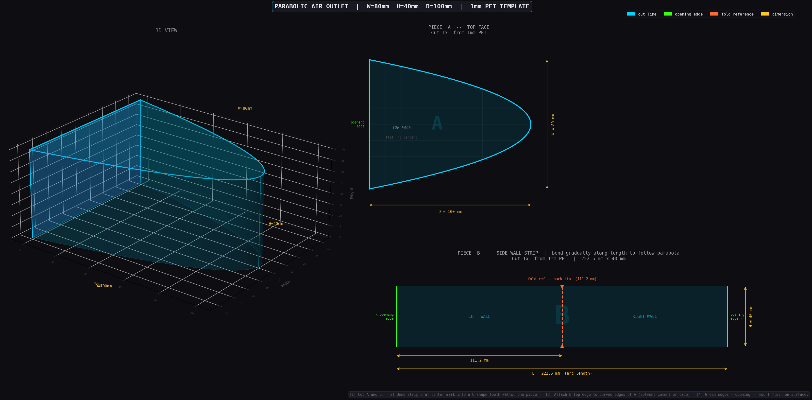

# parabolic-outlet

> *"Because eyeballing it with scissors wasn't working out."*

A CLI tool that generates a **3D visualization** and **2D flat-cut template** for an aerodynamic air outlet with a parabolic top-view profile. Print the template, cut two pieces from a PET sheet, bend and glue — done.



---

## What you get

A dark-mode PNG with three panels:

| Panel | What it is |
|---|---|
| **3D view** | Perspective render so you know what you're building |
| **Piece A** | Flat parabolic top face — cut as-is, no bending |
| **Piece B** | Side wall strip — one rectangle that bends into both walls |

The outlet shape follows:
```
x(s) = D · (1 - s²)
y(s) = (W/2) · s        s ∈ [-1, 1]
```
Opening height is always `H = W / 2`.

---

## Install

```bash
git clone https://github.com/clawdytheman-art/parabolic-outlet
cd parabolic-outlet
pip install -r requirements.txt
```

---

## Usage

```bash
# defaults: W=80mm, D=100mm
python outlet.py

# custom size
python outlet.py --width 120 --depth 150

# short flags, custom output, high DPI
python outlet.py -w 60 -d 80 -o my_part.png --dpi 300
```

### Options

```
-w, --width    Opening width in mm      (default: 80)
-d, --depth    Outlet depth in mm       (default: 100)
-o, --output   Output PNG filename      (default: outlet_template.png)
    --dpi      Output resolution in DPI (default: 150)
    --show     Open the image after saving
```

---

## Assembly

The tool prints a cut list with exact dimensions. Two pieces of 1mm clear PET:

1. **Cut** Piece A (parabolic outline) and Piece B (rectangle)
2. **Bend** strip B at its center mark — it forms a U-shape covering both side walls
3. **Attach** B's top edge to the curved edges of A (solvent cement, CA glue, or tape)
4. The green edges on the template are the opening — mount flush to the surface

No back piece needed — the parabola tapers to a ridge.

---

## License

MIT
